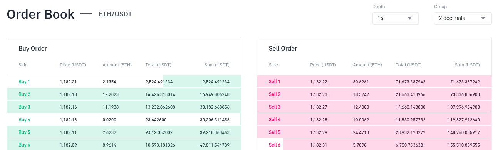
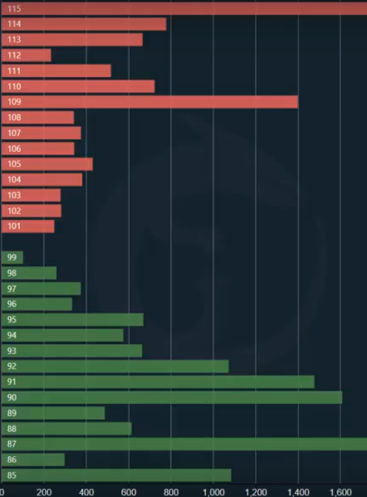

# Decentralized Exchanges (DEXs)

**Stocks**

Nathan is known for his delicious momos. It's been his dream to open a momo shop. He figures that it'll cost him $100,000 to start his business with all the supplies, staff, and other costs of starting a business. The problem is that Nathan only has $10000 to put into the momo shop. He can't build his business on $100,000.

Nathan decides to issue stocks to investors to help raise money. Stocks are pieces or shares of ownership in a company. Each share is worth a certain amount based on the company's value. A company issues shares to investors in order to raise money. Nathan decides to enlist the help of nine of his friends to invest the remaining $90000.However, to do this, Nathan must give away 90% of his business in shares. Nathan and his friends each own 10% of the business.

Five years later, Nathan Momo Shop is booming. His momo shop is now worth $1 million. Nathan got the money he needed to create the business without any additional risks or debt. Also, Nathan and his friends each turn their $10000 investment into $100000.Just like Nathan's friends bought shares in his shop, you can buy shares of publicly traded companies like Apple. If Apple has 100 shares and you own one, you own 1% of Apple.

**Financial Instruments**

They are monetary contract between two parties.They can be cash or evidence of ownership interest in an entity or a contractual right to receive or pay.It is any contract that gives rise to both of financial asset of one entity and financial liability of another entity.These financial instrument include primary instruments which covers receivable, payable and equity securities.Another is derivative instruments which covers options, futures and forwards and swaps.

The term contract is the arrangement between two or more parties that has clear economic consequences.The financial instruments are classified into financial assets, financial liabilities and equity instruments.Financial assets is any asset that is cash or contractual right or an equity instrument of another entity or certain contracts  that will or maybe settle in entity's own equity instruments.That is a company might exchange it's own equity shares for a fixed amount of cash or another financial asset.The contractual right is the right to receive cash or the right to receive another financial asset from another entity or it's a right to exchange financial instrument with another entity on a condition that it's potentially favourable to the entity.Common example of financial assets are cash, investment in bonds and deposists, trade receivables, investment in equity instruments and loan receivables.

Financial liabilites is any liability that is a contractual obligation to deliver cash or another financial asset to another entity or to exchange financial instruments with another entity under condition that are potentially unfavourable or certain contracts that will or maybe settled in entity's own equity instruments.Some common example of financial liabilites are loans and borrowings, trade payables, finance lease liabilities, redeemable instruments - preference shares, debentures etc, and gurantee.

Equity instruments are any contract that evidences the residual interest in the assets of an entity after deducting all of it's liability.Some common examples  are equity shares issued, warrants to issue fixed number of shares at a fixed price against each warrant or other instruments which are convertible into fixed number of equity shares.

Financial asset is any asset that is right to exchange financial instruments with another entity under condition that are potentially favourable to the entity where as financial liabilities  is a contractual obligation to exchange financial instrument with another entity under condition that are potentially unfavourable.Usually the classification of an item as financial asset or financial liabilities is understood from the point of view of the issuer.So if the exchange of the financial instrument happen under condition which will favourable to the issuer then it constitutes as financial assets else it's considered as a financial liablity.

For the users of financial statements, the accounting treatment of this instrument is crucial importance.In order to take care of the presentation, recognition and measurement and discloures of these financial instruments, there're standards by accounting bodies around the world.

**Order Book**

Assume we have a marketable instrument (stock, bond, or cryptocurrency). The order book for that instrument is going to be a set of all open orders. Understanding these outstanding orders is the most important part of trading. Many people start out by looking at historical data and charts. They try to predict prices, but once they get into the nitty-gritty of actually submitting orders, they run into trouble. We're starting with the order book because it allows us to understand what we're doing when we begin actually submitting orders, trying to take advantage of price movements.

Order books can be really intimidating when you look at them for the first time. They typically have a lot going on—changing numbers, flashing indicators. It's really hard to keep up if you've never looked at one before. Here is the [order book] (https://www.binance.com/en/orderbook/ETH_USDT) of ETH/USDT.

You can notice that you see some flashes and movements going on. When you try, it's difficult to see and understand what's going on. We'll look at an order book as an example. This is static; it doesn't have any movements, and it's got round numbers so that we can easily read it and understand what is going on.

On the vertical axis, we have prices in the market place.In this particular book, we start at 85 and move up to 115. On the horizontal axis, we have size. The size is the number of units. These units depend upon what particular financial instruments we're dealing with. These units could be shares, dollars, or coins. It can be any particular financial instrument that we want to deal with. Together, when we look at both the horizontal and vertical axes, we have the number of units at each price.

At 85, we have 1100 units; at 86, we have 300 units, and so on. If we are talking stocks, we would say that at each price, we have this many shares available on the order book. With respect to the order book, the word "available" can be one or more things. The shares or crypto coins could be available to either buyers or for seller.That is why we have two different colors—red and green. All of the prices in red with their corresponding units represent the number of coins or shares that are available for buyers. These are sellers in the marketplace who make supply available for buyers to enter the market.

On the green side, we have the number of bidders in the marketplace. This represents the number of shares or coins that a seller could use to get out of the market. So we have the sell side of the order book and the buy side of the order book.

The first thing we care about whenever we're going to make a trade is whether we're on the buy side or the sell side. We need to be thinking about the order book when we're thinking about which side we're going to be on because we're going to be targeting the other side. If we're trying to sell, we're going to be looking at buyers, and if we're trying to buy, we're going to be looking at sellers.

**Market**

When trading begins, we usually say, "We're trading in the markets." We can refer to it as the collection of financial instruments like stock, bonds, or crypto. We're going to talk about the market for specific financial instruments. We're going to use the same example of an order book here too.

From an economics perspective, they lead off by saying that a market is one of the many varieties of systems where parties engage in exchange. Most markets rely on sellers offering their goods in exchange for money from buyers. If we look at the order book, we have a buy side and a sell side. In our case, the sell side is offering bitcoin, which is the supply. On the buy side, the buyers are offering their money for bitcoin. This market economy is really very similar to what the order book gives us. The order book gives us the market.

According to finance, a financial market is a place in which people trade at prices that reflect supply and demand. The term "market" means the aggregate of the possible buyers and sellers of a certain good and the transactions between them. So the order book is showing us the supply (seller prices) and the demand (buyer prices). This definition is really saying the same thing that we saw before using different terms.

The terms buy and sell are used in the definition of economics. The terms demand and supply are used in finance. So economics and finance are telling us that a market requires buyers and sellers. This is also known as "supply" and "demand." If we have supply and demand, we're on our way to having a market. The order book gives us just that. An order book can be thought of as a market building block. The order books are the way that we organize the buyers and sellers. In a market, we must consider the total, including all buyers and sellers.
