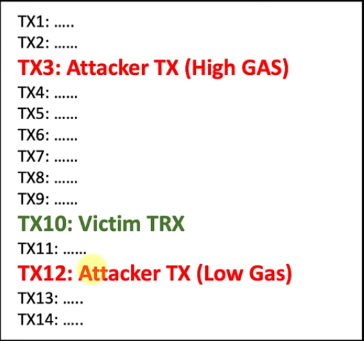

**Uniswap**

Uniswap is a protocol for the decentralized exchange of tokens on the Ethereum blockchain. It's deployed as a set of smart contracts and is completely decentralized, permissionless, and censorship-resistant. It is built on the concept of liquidity pools and AMM. The initial version of Uniswap was written in Vyper. In Uniswap V1, each liquidity pool had to include ETH as one of the currencies. For example, to trade from USDC to DAI, the user would have to trade the USDC for ETH and ETH for DAI, which usually results in higher gas fees and more slippage.

Uniswap launched Version 2 of the contract, offering ERC20-ERC20 liquidity pools. This is also preferable for liquidity providers who do not want to supply ETH and risk impermanent losses. V2 also had a few other features, including on-chain price feeds and flash swaps. All of the V2 smart contracts were written in Solidity. Due to its decentralized and permissionless nature, the first version of the protocol has been actively used alongside V2 for some time, regardless of the Uniswap team's encouragement to liquidity providers to migrate their liquidity to V2.

Sushiswap also came into play, which was aiming to directly compute with Uniswap by forking the project, adding a reward for Uniswap liquidity providers, and eventually stealing Uniswap liquidity onto the Sushiswap platform. This is also called a "Vampire Attack." The Sushiswap yield farming resulted in Uniswap liquidity going from around $300 million to almost $2 billion in a matter of days. Before the migration of Uniswap to Sushiswap started, there was still around $800 million worth of Uniswap liquidity staked on the Sushiswap platform. Although the Sushiswap migration resulted in Uniswap's total liquidity dropping from almost $2 billion to as low as $0.5 billion, the remaining liquidity was still higher than a couple of weeks earlier, which was $300 million before the Sushiswap project even started.

Later, Uniswap announced their Uni token. The most surprising part of the launch was how some of the tokens were retrospectively allocated. Everyone who had used Uniswap even once before the 1st of September was eligible to claim their 400 Uni tokens. The Uni tokens were distributed to around 50,000 Ethereum addresses, making them one of the most widely distributed tokens in the space. On top of that, the liquidity providers of the protocol were also retrospectively rewarded with extra Uni tokens. A total of 1 billion Uni tokens were allocated. 60% go to community members, 21.51% go to team members and future employees with a four-year vesting period, and 0.069% go to advisors with a four-year vesting period. After 4 years, there will be a perpetual inflation rate of 2% inflation per year to ensure continued participation and contribution to Uniswap at the expense of passive Uni holders.

On top of that, Uniswap announced incentives for liquidity pools that will reward liquidity providers with extra Uni tokens. Uni holders can also vote to add more incentivized pools after the initial 30-day governance grace period is over. By launching the token, the Uniswap team wanted to further decentralize the protocol, making it a publicly owned and self-sustaining financial infrastructure, while still continuing to protect its indestructible and autonomous qualities. The token holders will be able to participate in Uniswap governance by voting on different proposals or delegating their votes to a third party.


### High Level Working of Uniswap

**Creating markets using Uniswap Exchange Factories**

We've got a market maker who's going to create a market for us on Uniswap. The first thing that we have to do is use the `Uniswap Factory` smart contract. The market maker needs to create an exchange, so they call the `createExchange` function and pass in the address of the token that they want to register the exchange for.

```vyper
# Uniswap Factory
@public
def createExchange(token: address) -> address:
```

It basically calls the instantiation function like in OOP, which takes the exchange template and creates a new actual Uniswap exchange at an exchange address, which is an address on the Ethereum blockchain.

```vyper
# Uniswap Factory
exchange: address = create_with_code_of(self.exchangeTemplate)
```

It calls the setup method with the token address, which essentially creates two empty pools.

```vyper
# Uniswap Factory
Exchange(exchange).setup(token)
```

a token pool and an Ethereum pool, both of which are empty at the start of this exchange. Meanwhile, on the Uniswap factory, the exchange address is registered in a `token_to_exchange` mapping where the token address is mapped to the exchange address.

```vyper
self.token_to_exchange[token] = exchange
```

This allows us to go forward and get hold of the exchange by just passing in the token address. We can also get the exchange via the exchange address, and it'll return the token address.

```vyper
def getToken(exchange: address) -> address:
    return self.exchange_to_token[exchange]
```

So there's actually a reverse registration of this and an exchange for token address registration.

At this point, we've got our new exchange, but it's empty. We need to add liquidity.

**Adding liquidity to markets via Uniswap Exchanges**

Liquidity providers provide liquidity to the exchange. It's highly likely that the liquidity provider is the same person who created the exchange. He can call one of the new exchanges he has created, which in our example is Eth:DAI, which is located at `x` address. The liquidity provider interacts with the smart contract by calling the `addLiquidity` function and passing in the number of tokens that they want to add to the pool, and they also send some Ethereum using "msg.value."

```vyper
# Uniswap Exchange
@payable
def addLiquidity(min_liquidity: uint256, max_tokens: uint256, deadline: timestamp) -> uint256:
```

For example, this liquidity provider provides 100 ETH and 25,000 DAI, which is the end result after calling the method. This now sets the price for Eth:DAI. Basically, the liquidity pool ratio between Ethereum and the token is determined by the amount of liquidity, and so with this example, we're essentially setting the price of one ether to 250 DAI. If the ratio doesn't match the current market rates, this creates an arbitrage opportunity. As soon as an arbitrage opportunity is created, traders take advantage of it, and by taking advantage of it, the prices start to shift in the right direction, which eventually causes the exchanges to have a price that is near or as near as possible to the actual exchange. Once we have liquidity in our pool, we can start swapping tokens around.


**Swapping Ether for Tokens**

A trader is trading, and they want to swap some ethereum for some DAI. They first find our exchange, which is our Uniswap exchange that the liquidity provider created earlier, and call the `ethToTokenSwap` method.

```vyper
# Uniswap Exchange
@public
@payable
def ethToTokenTransferOutput(tokens_bought: uint256, deadline: timestamp, recipient: address) -> uint256(wei):
```

It adds the Ethereum that's passed into this method to the Ethereum pool, and it will subtract or withdraw an equivalent amount of tokens based on the ratio of the pair so that you get your tokens back at the price of this exchange. Some lines of code to actually achieve this are:


> invariant = eth_pool * token_pool

> This is something that's related to the market maker formula, which is really what keeps the pricing in check to determine the amount of token we need to withdraw from the exchange, i.e., x * y = k.

> Since we're adding Ethereum to an exchange, we simply need to add the amount sent in, which is in msg.value, to the Ethereum pool, and that gives a new Ethereum pool amount.

> new_eth_pool = eth_pool + msg.value

> Now we can use the invariant, and we divide the new_eth_pool minus the fee to calculate what the value of the token pool would be once we add Ethereum to the pool. So it basically calculates the new balance of the token pool based on the Ethereum added.

> new_token_pool = invariant / (new_eth_pool - (0.3% fee ))

> This allows us to calculate how many tokens we need to send back to the caller of the function, and that's just the number of tokens in the pool subtracted by the new_token_pool, which is going to be less than the current pool amount.

> tokens_out = token_pool - new_token_pool

**Swapping tokens for Ether**

This is exactly the opposite of an ether-to token swap. In this case, the Ethereum pool drops and the token pool increases.

```vyper
# Uniswap Exchange
@public
def tokenToEthTransferOutput(eth_bought: uint256(wei), max_tokens: uint256, deadline: timestamp, recipient: address) -> uint256:
```

The calculations are exactly the same as an Eth-token swap but in reverse.

> invariant = eth_pool * token_pool

> new_token_pool = token_pool + tokens_in

We add whatever the token was that was supplied to the pool.

> new_eth_pool = invariant / (new_token_pool - (0.3 % fee ))

> eth_out = eth_pool - new_eth_pool

**Swapping tokens for tokens**

Because Uniswap exchanges are paired with the Ether Pool, this is a very cool feature of Uniswap exchanges. So each exchange has an Ether pool and a token, and in this case we want to swap one token for another token.Because each exchange shares the fact that they're all paired with Ethereum and ether, we can basically trade between tokens.

We have two exchanges, one for Eth:DAI and another for Eth:BAT. The trader basically wants to trade their DAI tokens, so they're sending in DAI tokens and they want to trade them for BAT tokens. In order to do this, they need to call the `tokenToTokenSwap` function on the exchange of the token that they're currently holding.

```vyper
# Uniswap Exchange
@public
def tokenToTokenSwapOutput(tokens_bought: uint256, max_tokens_sold: uint256, max_eth_sold: uint256(wei), deadline: timestamp, token_addr: address) -> uint256:
```

So they call this a trade on the ETH:DAI exchange because they're passing DAI tokens, and they also pass the address of the BAT token to perform this trade. First of all, the token pool will be increased, and the Ethereum pool will be decreased. This is due to the fact that we are adding tokens to DAI and want to get ethereum out because this can only swap DAI for ethereum. But this trader wants BAT. How do we get the BAT coin?

We take the BAT token address passed in by the trader to find the exchange through the factory because when you register an exchange, the factory registers the address of the exchange, and you can look up the exchange by the token address. Then we can wrap that in an exchange class that points to the exchange via an interface and executes the function "ETH to token transfer" while passing in the trader's address and the amount of Ethereum deducted from the Ethereum pool.

Then we head over to the second contract, which is the ETH:BAT contract, and in this contract we call `ethToTokenTransfer` function, which adds the Ethereum to the pool and removes the BAT tokens accordingly based on the amount of the pool's current ratio. The same logic as an ETH to token swap is used, and then tokens are transferred back to the trader for the amount of BAT tokens taken out.


**Comparison of Unswap v1 vs v2 vs v3**

**Uniswap V1**

It allows traders on the Ethereum network to use AMM to trade with a pool of money at any point in time with very low fees, and they could theoretically trade for an infinite amount of coins. In Uniswap, you can give $200 and get 1 ETH, and then if you give $200 again, we will get 0.9 ETH because the price of Ethereum went up and the pool charged you more for it. The money in the pool is deposited by other investors, and we get to trade with their money. V1 had many different liquidity pools, and all the pools had to contain at least Ethereum. However, if you want to trade DAI for BAT, you have to interact with each pool, meaning extra work.

**Uniswap V2**

Version 2 fixed the above problem by creating pools that don't need Ethereum. Here, we can create any pool that we want, including a USDT and BAT pool that allows us to swap tokens.

**Uniswap V3**

The big update in V3 is `concentrated liquidity`.Liquidity means money that you provide to someone else so that they can use it for something.

- Concentrated liquidity
    The benefit of concentrated liquidity is that you can make your money work even harder by simply giving it some rules. Normally, when you want to be an investor and put your money into a uniswap pair like USDC or Ethereum, you lend your assets to the pool. Now the pool lets other traders trade your assets back and forth, basically collecting very small fees from those traders so that they can pay you. This way, traders are happy to trade, and you're happy to lend your money.

    When you provide liquidity, it evenly spreads your money for traders to use between the prices of 0 and infinity. This means that whether Ethereum goes to $100,000 or even plops down to $50, the money that you've provided is fairly allocated across all price ranges for traders. V3 changes this. Instead of letting your assets be spread thin across all price ranges, you can now select where you want to deploy your concentrated liquidity. So instead of giving it some USDC and then some Ethereum and then basically collecting fees, you can allow the liquidity pool to be used between price ranges, like using Eth:DAI only in the range of $3000 and $4000.
    
    The benefit of this is that your capital is essentially multiplied. When the price falls out of those ranges, two major things happen.
    -  You obviously stop earning fees.

    This is quite simple, as you only provided your assets to collect fees in those ranges.
    -  The money that you've provided will be turned into one single asset.
    
    For example, let's say that Ethereum is crashing. It crashes from $3500 to $1000. Previously, all of your capital was held in Ethereum and USDC. Now it's only in the form of Ethereum. In V2, you would always have at least a little bit of both tokens, but V3 changes that.
    
This is beneficial because by supplying between the ranges of $3000 and $4000, you're effectively placing a $3000 ethereum limit sell order and a $4000 limit buy order. In simple terms, if you supply liquidity between $3000 and $4000, you're basically saying that the LP would have all ETH if the price went under $3000 and only USD if the price went above $4000. Of course, there's going to be a little bit of impermanent loss.


- Concentrated Multiplier

Me and you both supply the ETH:USDC liquidity pool. For this example, let's assume Ethereum is $1750. The way that was done is V2, where the liquidity is spread evenly across all price ranges and you've invested $10,000. I, on the other hand, decide to supply $10,000 to the pool, but only when the price of Ethereum ranges from $1500 to $2500.

What fees do we both collect?

Well, it really depends upon the volume that Ethereum is trading at. Let's assume that you collect 4% a year, or $400. On the other hand, I, who deploy my capital in a specific range, will earn `eight and a third times` that much. So 8.3 * 400 = $3332. even though we've invested the same amount. But here's a case where I could get wrecked by an impermanent loss. Anyway, as long as the price does stay in that range, I will earn a much better return than you. Even a better way of thinking about it is that I could simply supply $1200, keeping all the $8800 safe, and earn the same amount in fees as you.

This concentrated liquidity is useful for situations like stablecoin pools, where there are two assets that hardly ever change in price in relation to each other. For example, the pool that holds DAI:USDC hardly ever gets out of the range of $0.99 to $1.01. The capital multiplier isn't 8.33 like in the example. It's 200 x, and the most you can get is 4000x. This only happens when you provide liquidity within a very narrow range of 0.1%.

- Active liquidity

If you supply liquidity in the range of $25 to $35 and two tokens, when the price of the tokens drops out of those ranges, your liquidity will instantly turn into one token. Essentially, the token is dumped whenever it reaches the $25 price point. After that, if the price keeps dropping, your liquidity is technically inactive. You're not earning any fees or even changing due to impermanent loss.

- NFT liquidity tokens

A LP token is given to the liquidity providers or investors so that they can prove that they actually provided money to a specific pool, and using that LP token, you can redeem it for your portion of the pool at any time. Another cool thing is that you can actually trade them, and in the past, there was only one type of LP token per pool. However, now that we have price ranges, we actually must create NFTs that have specific data attached to them. For example, I could have the NFT USDC:ETH LP token with a price range of $2000 to $3000.
    
- Licensing

This means you can't copy or fork the code for two years, and since a ton of other exchanges on the other networks are quite literally Uniswap with different branding,, Uniswap is not going to appreciate this. This licensing protects their code for a while.

There were a few fixes that actually made uniswap swaps even cheaper, meaning less gas fees.
  
    
    
**Frontrunning and sandwich attacks**

Sandwich attacks are a common type of DEX attack. It is a "frontrunning attack." Imagine that someone is running in front of you. You're going to do something, but someone is cutting you off and doing it before you're about to do it. Attackers are taking advantage of a victim who is trying to perform a swap. This can happen in every kind of DEX. In order to execute the attack, the attackers need to buy and sell the token on the same block, and in the middle of the transaction, the victim transaction is there trying to swap like a sandwich.



The miners who are building and verifying the blocks are taking the transactions and assembling the block one by one. They will receive the list of transactions, and the first transactions to enter the block will have the highest fee. That's why the attacker above is willing to pay high fees in order to place its transaction just before the victim's transaction, and the attacker will create another transaction with a lower gas price than the victim's transaction, which will be after the victim has swapped tokens.

**How is it related to slippage?**

Basically, all these things happen because users are willing to pay higher bids for a token. Once you set your `slippage tolerance` very high, like 20%, when transactions are created and sent to the blockchain, it's a parameter that's telling the smart contract how many tokens you're willing to receive. If you place 1%, it will set a large amount of tokens, but if you set 20%, you're basically telling the smart contract that you're willing to get fewer tokens in return. Once you set high slippage, attackers will detect your transaction and frontrun, making a sandwich and stealing the money.

Let's say I want to buy 5000 BUSD worth of ETH tokens. The current price of ETH is 20 BUSD. I'm setting a slippage tolerance of 20%. It means that I'm willing to buy 1 ETH for 24 BUSD, which is 20% more than $20. A potential attacker can earn those 20% on behalf of the victim, i.e., 20% of 5000 is $1000 BUSD.

But how does the attacker know about my transaction?

**MemPool**

All the appended transactions that are going to get into blocks are residing in the mempool. So every time I send a transaction to the blockchain, the transaction goes to the mempool, and the miners pick the transaction and put it into the blocks depending on the amount of fees I'm willing to pay. So transactions with higher fees are the first ones to get into the blocks.

Mempool is public, so the attacker has programs (a bot) that are connected to this kind of Ethereum node and constantly read the mempool, trying to hunt down transactions with high slippage amounts. So every time they find this kind of transaction before they get into the block, they simulate it and run it inside their simulator to see the workflow, like their buying transaction, victim buying transaction, and selling transaction, and try to find out if they are profitable. If they're profitable, they'll launch the transaction on the blockchain.
    


