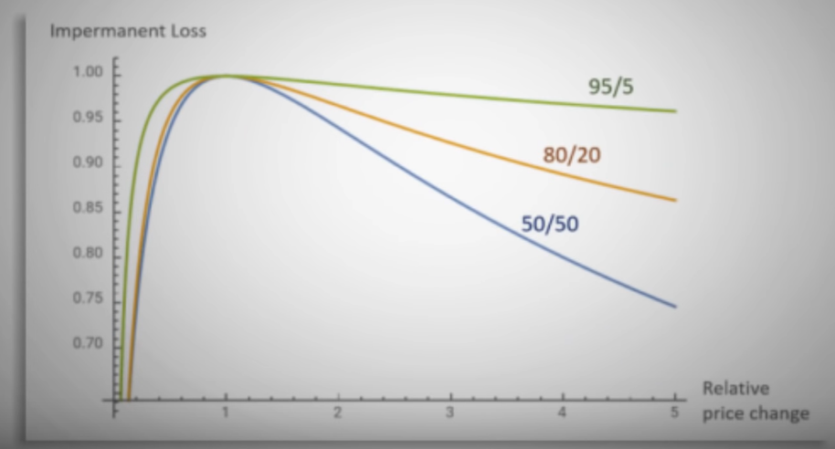

## Balancer

### Index

S&P 500 is stock market index tracking the stock performance of 500 large companies listed on stock exchanges in the United States. The price movement of these 500 top companies can be known by this S&P500 index.So when we say "S&P500 crossed 5000."This means the value of the index of all those companies got raised to 5000.

### Index fund

If any fund that spends in such index, we call them index fund.Basically index fund is a kind of  mutual fund only. In mutual fund, we can invest in stocks in different ways but in index fund it's a clear mandate. This means if any index fund is saying "We'll invest in S&P500", they'll invest in s&P500 only.

## What is Balancer?

A Balancer Pool is an automated market maker with a few crucial characteristics that enable it to act as a price sensor and self-balancing weighted portfolio.Balancer turns the concept of an index fund on its head: instead of paying fees to portfolio managers to rebalance your portfolio, you collect fees from traders, who rebalance your portfolio by following arbitrage opportunities.The Balancer is built on a specific N-dimensional surface that establishes a price for exchanging any two tokens held in the Balancer pool. 

Balancer allows for its trading pairs (called pools) to consist of multiple tokens — anywhere between 2 and 8, each token with a different arbitrary share of the pool (from 2% to 98%). This differs from 50/50 AMMs, which depend on the x*y=k equation. Balancer Pools are extremely customizable, allowing anybody to create a pool with custom fees (ranging from 0.00001% to 10%).

This enables Balancer to provide a kind of self-balancing index fund that is the opposite of an ETF, where instead of paying a portfolio manager to maintain the ETF's balance as the prices of the assets that make it up change inexorably, in the inverse ETF you, as a liquidity provider, get paid when the ETF is rebalanced. This works because market participants are compelled to rebalance the portfolio in order to seize arbitrage opportunities. You get paid as the fund's investor through their fees. 

A Balancer pool has the following variables:
```
    Change Tokens — add or remove tokens from the pool (2 to 8)
    Change Weights — change the weighting of any token in the pool (2% to 98%)
    Change Fee (0.00001 to 10%)
    White/blacklist LPs — limit the particular addresses that can become LPs in the pool
    Limit Max Deposited Value — limit the maximum value LPs can deposit
    Start/Stop Trading — pause trading for the pool.
```

With that, there are three types of pools:

```
    public pools (also called shared)— anyone can add liquidity (and get Balancer Pool Tokens in return), but all the pool parameters are fixed forever. (trustless, finalized)
    private pools — all the parameters are flexible — only the owner can change them but also only the owner can add liquidity (trusted, unfinalized)
    smart pools — anybody can add liquidity to them and the parameters can be fixed or dynamic controlled through smart contracts. (trustless, flexible).
```

Pools with strong assets having a higher percentage usually results in less imparmanent loss.



The trade-off for this imparmanent loss is usually a higher slippage amount for traders.Essentially the result of less liquidity for the tokens with less weight.

### Liquidity bootstrapping pools

Unfortunately, Uniswap’s 50/50 approach to token pricing means that little total volume can produce huge swings in pricing, creating both irrational price-discovery and serving a bad job as a token distribution mechanism where bots can front-run the community with the ability to run a pump & dump scheme on them. Further, this model requires a lot of capital to be deployed from the founding team (after all, the other 50% needs to be in an established token like ETH).

To solve this, Balancer offers the so-called Liquidity Bootstrapping Pools. This means that Balancer supports automatic rebalancing of specific assets. It has another pool type called "liquidity bootstrapping pool," which is primarily used for newly created tokens or projects. The idea is that they generally start a pool with 10% of a highly liquid or trusted coin and then 90% of a new project's coin. The project will also select an ending weight, typically 50/50. One of the last primary steps is to set a specific timeframe to run the liquidity bootstrapping pool. It could be days, weeks, or even months, and once the pool begins, the ratio of assets will change over that specified time period. So basically, it will start off at 90/10 and end up at 50/50. The result is that the token price continually experiences downward pressure throughout the sale. When this is mixed with modest buying demand, the price stays stable throughout the sale, as whales/bots are disincentivized to buy it all at once.It's a very successful way to launch a new token.

## How does the balancer work?

Balancer has two primary functions: portfolio manager and AMM. There's a smart contract for each pool. In each pool, you have a combination of 2–8 ERC-20 tokens. The first step in the pool lifecycle is to create a pool. Anybody could create a pool using the "BFactory" contract. When we create a new pool, it creates a new smart contract and registers its address in the B Factory contract. It also registered the address that initiated the transaction, which is the controller of the pool and has some special rights.

After a pool has been created, it's in a state called "Not Finalized." The controller is the only address that can interact with the pool until it is finalized. It's a private pool. During this state, the controller can change the parameters of the pool tokens, weights in the pool, and trading fee. This trading fee will be given to the liquidity providers for every trade and for the ability for others to trade with the pool in its not-finalized state. It's possible to stay in its not-finalized state forever. For example, if the controller of a pool is a smart contract, it can adjust the token weight and trading fees as many times as desired during the life cycle of the pool. That's what we call a smart pool.

Another possibility is to set the state of the pool to "finalized." After you do this, it's not possible anymore to change the parameters of the pool, and any address is able to trade with the pool; it becomes a public pool.

Before trading, we need liquidity. Adding liquidity works similarly to Uniswap. So you deposit tokens, and you get some BLP tokens. While your tokens are locked in the pool, you earn trading fees. When you provide liquidity, you can either send only one of the tokens in the pool or all of the tokens, but in this case, you have to respect the weight of the pool. Once you've got liquidity, you can trade. To trade, you provide a token of the pool as input and get another token of the pool as output.

The price is determined by a pricing formula for the pool, which is a generalization of the constant product formula of Uniswap.

## Smart Contract walkthrough 

If I don't write the explanation below the code, it means that I don't know what it's doing or why they have declared it, but later down the line you'll figure out the purpose.

### BFactory.sol 

This contract builds the new pool and log their addresses.

```solidity
import "./BPool.sol";
```

We need BPool contract to create a new pool from the factory contract.

```solidity
contract BFactory is BBronze {}
```

BFactory contract is inheriting BBronze contract which just returns the bytes32 of the "BRONZE". I don't exactly know why we're returning this yet.

```solidity 
event LOG_NEW_POOL(
        address indexed caller,
        address indexed pool
    );

    event LOG_BLABS(
        address indexed caller,
        address indexed blabs
    );
```

Events for logging when a new pool is created and old blab address and new blab address. 

```solidity
mapping(address=>bool) private _isBPool;
```

Mapping for whether the address is a pool or not.

```solidity
function isBPool(address b)
        external view returns (bool)
    {
        return _isBPool[b];
    }
```

This function returns whether that address is a pool or not.

```solidity
function newBPool()
        external
        returns (BPool)
    {}
```

This is the function for creating new pool from factory contract.

```solidity
BPool bpool = new BPool();
```

instantiate of BPool contract variable.Uniswap used interface to create pool but here we're instantiating a contract with the new keyword and then we'll create the pool.

```solidity
_isBPool[address(bpool)] = true;
```

We're setting that bpool variable address to true because that is the pool we just created.

```solidity
emit LOG_NEW_POOL(msg.sender, address(bpool));
```

We're emitting address that created the pool and the pool address.

```solidity
bpool.setController(msg.sender);
```

We're setting the controller to be the creater because controller has special rights regarding that pool.

```solidity
return bpool;
```

We're returning that pool.

```solidity
address private _blabs;
```

We're creating the _blabs private variable because we might decide later on to now use that wallet address. One can change wallet address.

```solidity
constructor() public {
        _blabs = msg.sender;
    }
```

We're setting the blabs address to the deployer in the constructor. That means Balancer's address will be the "_blabs".

```solidity
function getBLabs()
        external view
        returns (address)
    {
        return _blabs;
    }
```

Getter for that blabs variable.

```solidity
function setBLabs(address b)
        external
    {}
```

This function sets the blabs address. This might be giving right about that pool to new address.

```solidity
require(msg.sender == _blabs, "ERR_NOT_BLABS");
```

This require statement blows if the caller is not blabs address.

```solidity
emit LOG_BLABS(msg.sender, b);
```

emits the old and new blabs addresses.

```solidity
_blabs = b;
```

sets the new address to the blabs.

```solidity
function collect(BPool pool)
        external 
    {}
```

This function is for collecting rewards "developer fee". It will only be on by the governance.

```solidity
require(msg.sender == _blabs, "ERR_NOT_BLABS");
```

This line made me believe that the function is for collecting developer fees because initially "_blabs" is the deployer of the contract which is Balancer itself.

```solidity
uint collected = IERC20(pool).balanceOf(address(this));
```

This returns the balance of the liquidity pool token "BPT" that this contract is holding for the developer to collect developer fees.

```solidity
bool xfer = pool.transfer(_blabs, collected);
require(xfer, "ERR_ERC20_FAILED");
```

This transfer the collected balance from the contract to the _blabs address and for the transaction to execute successfully, xfer must be true.


## BPool.sol

```solidity
import "./BToken.sol";
import "./BMath.sol";
```

It imports it's ERC20 token contract and math for the DeFi calculation. We'll go into essential math for the balancer protocol.

```solidity
contract BPool is BBronze, BToken, BMath {
}
```

BPool contract is inheriting from other three contract. BBronze simple returns bytes32 of the "BRONZE", BToken is the ERC20 implementation of their token "BPT" and BMath is for all mathematical calculation and automation.

```solidity
struct Record {
        bool bound;   // is token bound to pool
        uint index;   // private
        uint denorm;  // denormalized weight
        uint balance;
    }
```

```solidity
event LOG_SWAP(
        address indexed caller,
        address indexed tokenIn,
        address indexed tokenOut,
        uint256         tokenAmountIn,
        uint256         tokenAmountOut
    );
```

This is an event for swapping the token.

```solidity
 event LOG_JOIN(
        address indexed caller,
        address indexed tokenIn,
        uint256         tokenAmountIn
    );
    
  event LOG_EXIT(
        address indexed caller,
        address indexed tokenOut,
        uint256         tokenAmountOut
    );
```

Join is an event for how much token I want to swap and EXIT for how much I got.

```solidity
event LOG_CALL(
        bytes4  indexed sig,
        address indexed caller,
        bytes           data
    ) anonymous;
```

This is an anonymous event where it fires signature of the caller, caller address and any data.Anonymous events are cheaper and can only be called using contract address.

```solidity
modifier _logs_() {
        emit LOG_CALL(msg.sig, msg.sender, msg.data);
        _;
    }
``` 

Interesting modifier for firing events maybe for gas efficient.

```solidity
modifier _lock_() {
        require(!_mutex, "ERR_REENTRY");
        _mutex = true;
        _;
        _mutex = false;
    }
``` 

This modifier prevents the re-entracy attack.

```solidity
modifier _viewlock_() {
        require(!_mutex, "ERR_REENTRY");
        _;
    }
```

To viewlock mutex needs to be false.

```solidity 
bool private _mutex;
```

private variable for the mutex. It's just like a flag variable. One get to enter if the flag is false and the entered contract / address sets the mutex to true.

```solidity
address private _factory;    // BFactory address to push token exitFee to
```

"_factory" is the address of the factory contract.

```solidity
address private _controller; // has CONTROL role
```

The controller of the liquidity pool.

```solidity
bool private _publicSwap; // true if PUBLIC can call SWAP functions
```

It determines whether the pool is public or private.

```solidity
uint private _swapFee;
```

It's a fee for the swap in a liquidity pool.

```solidity
bool private _finalized;
```

Pool is finalized then it can be changed like swapFee and people can interact with the pool.

```solidity
address[] private _tokens;
```

```solidity
mapping(address=>Record) private  _records;
```

This mapping keeps track of the properties of that particular token.

```solidity
uint private _totalWeight;
```

total weightage of the pool of the token.

```solidity
constructor() public {
        _controller = msg.sender;
        _factory = msg.sender;
        _swapFee = MIN_FEE;
        _publicSwap = false;
        _finalized = false;
    }
```

controller and factory are both factory contract because this pool contract is being called by the factory contract.It sets the min fee, public swap and finalized to be false because it's not public to swap and the pool is not finalized yet.

```solidity
function isPublicSwap()
        external view
        returns (bool)
    {
        return _publicSwap;
    }

    function isFinalized()
        external view
        returns (bool)
    {
        return _finalized;
    }

    function isBound(address t)
        external view
        returns (bool)
    {
        return _records[t].bound;
    }
```

These are view functions.

```solidity
function getNumTokens()
        external view
        returns (uint) 
    {
        return _tokens.length;
    }
```

```solidity
function getCurrentTokens()
        external view _viewlock_
        returns (address[] memory tokens)
    {
        return _tokens;
    }
```

```solidity
function getFinalTokens()
        external view
        _viewlock_
        returns (address[] memory tokens)
    {
        require(_finalized, "ERR_NOT_FINALIZED");
        return _tokens;
    }
```

```solidity
function getDenormalizedWeight(address token)
        external view
        _viewlock_
        returns (uint)
    {

        require(_records[token].bound, "ERR_NOT_BOUND");
        return _records[token].denorm;
    }
```

```solidity
function getTotalDenormalizedWeight()
        external view
        _viewlock_
        returns (uint)
    {
        return _totalWeight;
    }
```

```solidity
function getNormalizedWeight(address token)
        external view
        _viewlock_
        returns (uint)
    {

        require(_records[token].bound, "ERR_NOT_BOUND");
        uint denorm = _records[token].denorm;
        return bdiv(denorm, _totalWeight);
    }
```

```solidity
function getBalance(address token)
        external view
        _viewlock_
        returns (uint)
    {

        require(_records[token].bound, "ERR_NOT_BOUND");
        return _records[token].balance;
    }
```

This function returns how much balance that particular token is. "_viewlock_" is a modifier which needs the mutex to be false.This function also needs that the token must be bound to the pool and then only returns the balance of that token.

```solidity
function getSwapFee()
        external view
        _viewlock_
        returns (uint)
    {
        return _swapFee;
    }
```

Simply returns the swapFee of the pool.

```solidity
function getController()
        external view
        _viewlock_
        returns (address)
    {
        return _controller;
    }
```

Returns the controller of the pool.Controller has special right regarding the pool. We can say to be the creator of the pool.

```solidity
function setSwapFee(uint swapFee)
        external
        _logs_
        _lock_
    { }
```

Function sets the swap fee. "_logs_" modifier just emits an event i.e signature, msg.sender and the data. Similary "_lock_" modifier needs to have needs to have mutex to false, then sets mutex to true during this no any address could set the swap fee and after work is done sets the mutex to false.

```solidity
require(!_finalized, "ERR_IS_FINALIZED");
```

Can only set the swap fee when the pool is not finalized.

```solidity
require(msg.sender == _controller, "ERR_NOT_CONTROLLER");
```

Only the creator of the pool can set the swap fee.

```solidity
require(swapFee >= MIN_FEE, "ERR_MIN_FEE");
require(swapFee <= MAX_FEE, "ERR_MAX_FEE");
```

swap fee must be greater than equal to min fee and less than equal to max fee.We can see max and min fee from "BConst.sol".

```solidity
uint public constant BONE              = 10**18;
uint public constant MIN_FEE           = BONE / 10**6;
uint public constant MAX_FEE           = BONE / 10;
```

```solidity
_swapFee = swapFee;
```

Sets the swap fee provided by the controller.

```solidity
function setController(address manager)
        external
        _logs_
        _lock_
    {
        require(msg.sender == _controller, "ERR_NOT_CONTROLLER");
        _controller = manager;
    }
```

Sets the controller but only by the previous controller.

```solidity
function setPublicSwap(bool public_)
        external
        _logs_
        _lock_
    {
        require(!_finalized, "ERR_IS_FINALIZED");
        require(msg.sender == _controller, "ERR_NOT_CONTROLLER");
        _publicSwap = public_;
    }
```

Sets the pool to be public so that anybody could interact with the pool.

```solidity
function finalize()
        external
        _logs_
        _lock_
    {}
```

This function sets the pool to be finalized. Once the pool is finalized, we can't change the parameters of the pool like swap fee.

```solidity
require(msg.sender == _controller, "ERR_NOT_CONTROLLER");
```

Only the controller / creator of the pool can finalize the pool.

```solidity
require(!_finalized, "ERR_IS_FINALIZED");
```

Pool needs not to be finalized.

```solidity
require(_tokens.length >= MIN_BOUND_TOKENS, "ERR_MIN_TOKENS");
```

There must be atleast two tokens.

```solidity
_finalized = true;
_publicSwap = true;
```

Sets these parameters of the pools to be true.

```solidity
_mintPoolShare(INIT_POOL_SUPPLY);
```

This is an internal function defined at the end of the BPool contract.This "INIT_POOL_SUPPLY" is from BConst which is 100 * 10 ** 18

```solidity
function _mintPoolShare(uint amount)
        internal
    {
        _mint(amount);
    }
```

This "_mint" is an internal function inside "BTokenBase" which BToken inherits.

```solidity
function _mint(uint amt) internal {
        _balance[address(this)] = badd(_balance[address(this)], amt);
        _totalSupply = badd(_totalSupply, amt);
        emit Transfer(address(0), address(this), amt);
    }
```

This function mints the "BPT" token. This "badd" is a function taken from "BNum.sol" which just checks for addition overflow while adding the balance of the BPT token in the contract  of the BToken and also adds the totalSupply and emits and event saying this much token minted has been transferred from address 0 to this Btoken contract.

```solidity
_pushPoolShare(msg.sender, INIT_POOL_SUPPLY);
```

This is also an internal function which takes the controller address and total supply.

```solidity
function _pushPoolShare(address to, uint amount)
        internal
    {
        _push(to, amount);
    }
```

This function again calls internal "_push" function which is an internal function define in "BTokenBase" contract.

```solidity
function _push(address to, uint amt) internal {
        _move(address(this), to, amt);
    }
```

Again this function also calls "_move function".

```solidity
function _move(address src, address dst, uint amt) internal {
        require(_balance[src] >= amt, "ERR_INSUFFICIENT_BAL");
        _balance[src] = bsub(_balance[src], amt);
        _balance[dst] = badd(_balance[dst], amt);
        emit Transfer(src, dst, amt);
    }
```

This internal function subtracts the BPT balance from the contract and add the supplied amount to the controller and emits an events.

So this "_pushPoolShare" simply transfers token from the contract to the controller.

```solidity
function bind(address token, uint balance, uint denorm)
        external
        _logs_
        // _lock_  Bind does not lock because it jumps to `rebind`, which does
    {}
```

This function binds the token to the pool. It means simply attaching the token if we want to provide the liquidity.

```solidity
require(msg.sender == _controller, "ERR_NOT_CONTROLLER");
```

Only the controller can call the function.

```solidity
require(!_records[token].bound, "ERR_IS_BOUND");
```

Tokens must not be bound to the pool.

```solidity
require(!_finalized, "ERR_IS_FINALIZED");
```

pool must not be finalized.

```solidity
require(_tokens.length < MAX_BOUND_TOKENS, "ERR_MAX_TOKENS");
```

Tokens in a pool must be less than 8 because

```solidity
uint public constant MAX_BOUND_TOKENS  = 8;
```

```solidity
_records[token] = Record({
            bound: true,
            index: _tokens.length,
            denorm: 0,    // balance and denorm will be validated
            balance: 0   // and set by `rebind`
        });
```

Here we populate the mapping, and `this shows the reason behind using the struct in the beginning.`  Bound denotes whether the token is linked to the pool or not, index represents how many tokens are present inside the pool, we still have no idea about denorm, and balance is set by rebinding, probably the balance of the LP token.

```solidity
_tokens.push(token);
```

We push the token that we want to keep in the pool.

```solidity
rebind(token, balance, denorm);
```

Then we call the rebind function.

```solidity
function rebind(address token, uint balance, uint denorm)
        public
        _logs_
        _lock_
    {}
```

```solidity
require(msg.sender == _controller, "ERR_NOT_CONTROLLER");
require(_records[token].bound, "ERR_NOT_BOUND");
require(!_finalized, "ERR_IS_FINALIZED");
```

This are same requires as in "bind" function.

```solidity
require(denorm >= MIN_WEIGHT, "ERR_MIN_WEIGHT");
require(denorm <= MAX_WEIGHT, "ERR_MAX_WEIGHT");
require(balance >= MIN_BALANCE, "ERR_MIN_BALANCE");
```

Denormalized weight. Weights on a BPool, though often displayed as percentages, are configured and stored in their denormalized form. For instance, in a two-token pool with denormalized weights of A = 38 and B = 2, token A's percentage weight would be 38/(38 + 2), or 95%. Conversely, token B's proportion would be 2/(38+2), or 5%.

So denorm must be greater than min weight, i.e., 10 ** 18, and less than max weight, i.e., 10 ** 68, and the balance of the token must be greater than min balance, i.e., 10 ** 6.

```solidity
// Adjust the denorm and totalWeight
uint oldWeight = _records[token].denorm;
```

We're getting the percentage or portion of a particular token in the pool.

```solidity
if (denorm > oldWeight) {
            _totalWeight = badd(_totalWeight, bsub(denorm, oldWeight));
            require(_totalWeight <= MAX_TOTAL_WEIGHT, "ERR_MAX_TOTAL_WEIGHT");
        } 
```

If the passed percentage is greater than the weightage of the pool, we first subtract the weightage and then add to the total weight. Maybe this total weightage represents the total LP tokens in the pool. The total weight must then be less than or equal to the maximum total weight, i.e., 10 ** 68.

```solidity
else if (denorm < oldWeight) {
            _totalWeight = bsub(_totalWeight, bsub(oldWeight, denorm));
        }   
```

If the weight of that token is greater, we subtract the old and new weights and then subtract the result from the total weight.

This "else" condition adjusts the weight of the token in the pool.

```solidity
_records[token].denorm = denorm;
```

We pass the adjusted weightage.

```solidity
// Adjust the balance record and actual token balance
uint oldBalance = _records[token].balance;
```

Now it's time to adjust the balance of that token.

```solidity
_records[token].balance = balance;
```

We directly store the supplied balance of the token here.

```solidity
if (balance > oldBalance) {
            _pullUnderlying(token, msg.sender, bsub(balance, oldBalance));
        } 
```

If the balance is greater than the balance present in the token, we call it the "pullUnderlying" function.

```solidity
function _pullUnderlying(address erc20, address from, uint amount)
        internal
    {
        bool xfer = IERC20(erc20).transferFrom(from, address(this), amount);
        require(xfer, "ERR_ERC20_FALSE");
    }
```

This function just transfers the token from the account to the pool.

```solidity
else if (balance < oldBalance) {
            // In this case liquidity is being withdrawn, so charge EXIT_FEE
            uint tokenBalanceWithdrawn = bsub(oldBalance, balance);
            uint tokenExitFee = bmul(tokenBalanceWithdrawn, EXIT_FEE);
            _pushUnderlying(token, msg.sender, bsub(tokenBalanceWithdrawn, tokenExitFee));
            _pushUnderlying(token, _factory, tokenExitFee);
        }
```

If the balance is less than the old balance, we're withdrawing the balance of that token. So first we calculate the amount to be withdrawn, store it in tokenBalanceWithdrawn, calculate the tokenExitFee, which we will discuss in a second, transfer the token from this pool to the account, and also transfer the exit fee to the factory contract.


```solidity
function bmul(uint a, uint b)
        internal pure
        returns (uint)
    {
        uint c0 = a * b;
        require(a == 0 || c0 / a == b, "ERR_MUL_OVERFLOW");
        uint c1 = c0 + (BONE / 2);
        require(c1 >= c0, "ERR_MUL_OVERFLOW");
        uint c2 = c1 / BONE;
        return c2;
    }
```

This is the multiplication function taken from BNum.sol. First we store the result of two numbers in c0, check for multiplication overflow, calculate c1, which must be greater than c0, then calculate c2, which is the divisor of c1 and Bone, and then return the result.

EXIT_FEE is 0, so c0 is 0. We pass the first require statement. Then c1 will be 10 ** 9. Again, we pass the require statement. c2 will then be "10 ** -9."

So we transfer such a minute amount to the factory contract.


```solidity
function unbind(address token)
        external
        _logs_
        _lock_
    {}
```

```solidity
require(msg.sender == _controller, "ERR_NOT_CONTROLLER");
require(_records[token].bound, "ERR_NOT_BOUND");
require(!_finalized, "ERR_IS_FINALIZED");
```

The same require statement is used as in the bind function.

```solidity
uint tokenBalance = _records[token].balance;
```

We get the balance of that token.

```solidity
uint tokenExitFee = bmul(tokenBalance, EXIT_FEE);
```

Calculate the token exit fee.

```solidity
 _totalWeight = bsub(_totalWeight, _records[token].denorm);
 ```
 
The total weight will be the subtraction of that token weight from the total weight. It's like if a basket contained 5 kg of mango and 5 kg of apple. The total weight is ten kilograms. So if we want to take mango, then the basket weight is 5 kg, and that is what we're doing here.
 
 ```solidity
 // Swap the token-to-unbind with the last token,
// then delete the last token
uint index = _records[token].index;
uint last = _tokens.length - 1;
```

We get the total token in the index, reduce the length, and store it in the last variable.

```solidity
_tokens[index] = _tokens[last];
```

We store the reduced token length.

```solidity
_records[_tokens[index]].index = index;
```

Last un bind token will be the initail index. IDK why.

```solidity
_tokens.pop();
```

Remove that token from the array.

```solidity
_records[token] = Record({
            bound: false,
            index: 0,
            denorm: 0,
            balance: 0
        });
```

That token is no longer bound to the pool.

```solidity
_pushUnderlying(token, msg.sender, bsub(tokenBalance, tokenExitFee));
```

Transfer that token to the account.

```solidity
_pushUnderlying(token, _factory, tokenExitFee);
```

Transfer the token exit fee to the factory contract.

```solidity
// Absorb any tokens that have been sent to this contract into the pool
    function gulp(address token)
        external
        _logs_
        _lock_
    {
        require(_records[token].bound, "ERR_NOT_BOUND");
        _records[token].balance = IERC20(token).balanceOf(address(this));
    }
```

This function stores the token balance that's been sent to this contract.

```solidity
function getSpotPrice(address tokenIn, address tokenOut)
        external view
        _viewlock_
        returns (uint spotPrice)
    {}
```

This function gets the current price of the asset in the marketplace. If ETH is 1600 $ and I enter ETH and USD, the result must be 1600 * 10 ** 18. This is the rate at which we can exchange.

```solidity
require(_records[tokenIn].bound, "ERR_NOT_BOUND");
require(_records[tokenOut].bound, "ERR_NOT_BOUND");
```

Both tokens must be bound to the pool.

```solidity
Record storage inRecord = _records[tokenIn];
Record storage outRecord = _records[tokenOut];
```

We create the storage variable of type "Record," which is the struct, and store all the information about it from the mapping records to this storage variable.

```solidity
return calcSpotPrice(inRecord.balance, inRecord.denorm, outRecord.balance, outRecord.denorm, _swapFee);
```

Then we pass the balance, their weights, and the swap fee to this function.

```solidity
/**********************************************************************************************
    // calcSpotPrice                                                                             //
    // sP = spotPrice                                                                            //
    // bI = tokenBalanceIn                ( bI / wI )         1                                  //
    // bO = tokenBalanceOut         sP =  -----------  *  ----------                             //
    // wI = tokenWeightIn                 ( bO / wO )     ( 1 - sF )                             //
    // wO = tokenWeightOut                                                                       //
    // sF = swapFee                                                                              //
    **********************************************************************************************/
    function calcSpotPrice(
        uint tokenBalanceIn,
        uint tokenWeightIn,
        uint tokenBalanceOut,
        uint tokenWeightOut,
        uint swapFee
    )
        public pure
        returns (uint spotPrice)
    {
        uint numer = bdiv(tokenBalanceIn, tokenWeightIn);
        uint denom = bdiv(tokenBalanceOut, tokenWeightOut);
        uint ratio = bdiv(numer, denom);
        uint scale = bdiv(BONE, bsub(BONE, swapFee));
        return  (spotPrice = bmul(ratio, scale));
    }
```

This is the function taken from BMath.sol. This is like the constant product formula, i.e., x * y = k, that Uniswap uses.

We first calculate the numer, which is just the ratio of the token balance that we want to exchange with its weight. Denom is a token that we want for its weight. Then we calculate the ratio. After this, we calculate the scale and multiply the result by the scale to get the result.

```solidity
function getSpotPriceSansFee(address tokenIn, address tokenOut)
        external view
        _viewlock_
        returns (uint spotPrice)
    {}
``` 

This function calculates the spot price if the swap fee is zero. Everything is the same as with the above function, except this takes 0 in swapFee.

```solidity
function joinPool(uint poolAmountOut, uint[] calldata maxAmountsIn)
        external
        _logs_
        _lock_
    {}
```

This function allows liquidity providers to join the existing pool and get LP tokens based on the amount they have provided.

```solidity
require(_finalized, "ERR_NOT_FINALIZED");
```

pool must be finalized to join.

```solidity
uint poolTotal = totalSupply();
```

totalSupply is the ERC20 implementation that returns the total supply of the liquidity token.

```solidity
uint ratio = bdiv(poolAmountOut, poolTotal);
```

We calculate the ratio based on how much liquidity token we're giving to the liquidity provider.

```solidity
require(ratio != 0, "ERR_MATH_APPROX");
```

Of course, the ratio must be greater than 0 because we can't give more liquidity tokens than the total supply.

```solidity
for (uint i = 0; i < _tokens.length; i++) {}
```

We go through every token that the creator of the pool has mentioned. If the creator has mentioned ETH, USD, and USDT, we go through each token that the newly joined liquidity provider is going to provide.

```solidity
address t = _tokens[i];
```

We store the address of each token.

```solidity
uint bal = _records[t].balance;
```

We get the balance of the tokens in the pool.

```solidity
uint tokenAmountIn = bmul(ratio, bal);
```

We calculate how much the newly joined liquidity provider must pay. "bmul" is a function taken from BNum that checks for multiplication overflow.

```solidity
require(tokenAmountIn != 0, "ERR_MATH_APPROX");
```

The token amount that we need to pay must be greater than 0.

```solidity
require(tokenAmountIn <= maxAmountsIn[i], "ERR_LIMIT_IN");
```

The token that we need to pay must not be greater than the amount that we have specified. If so, we have to do the calculation again.

```solidity
_records[t].balance = badd(_records[t].balance, tokenAmountIn);
```

We add the balance for that token in our "_records" mapping.

```solidity
emit LOG_JOIN(msg.sender, t, tokenAmountIn);
```

We emit an event saying that this liquidity provider has provided this amount of this token.

```solidity
_pullUnderlying(t, msg.sender, tokenAmountIn);
```

We get that token balance from the joint liquidity provider for this contract.

```solidity
_mintPoolShare(poolAmountOut);
```

We mint the liquidity token for that liquidity provider.

```solidity
_pushPoolShare(msg.sender, poolAmountOut);
```

We transfer that amount to the liquidity provider.

```solidity
function exitPool(uint poolAmountIn, uint[] calldata minAmountsOut)
        external
        _logs_
        _lock_
    {}
```

This function is used when a liquidity provider wants to take out all of his or her tokens.

```solidity
require(_finalized, "ERR_NOT_FINALIZED");

uint poolTotal = totalSupply();
```

The pool must be finalized, and we must obtain the total supply of tokens for the pool.

```solidity
uint exitFee = bmul(poolAmountIn, EXIT_FEE);
```

Liquidity providers need to pay a fee while exiting the pool.

```solidity
uint pAiAfterExitFee = bsub(poolAmountIn, exitFee);
```

We calculate the exact token after subtracting the exit fee.

```solidity
uint ratio = bdiv(pAiAfterExitFee, poolTotal);
require(ratio != 0, "ERR_MATH_APPROX");
```

We get the ratio, which must be greater than 0.

```solidity
_pullPoolShare(msg.sender, poolAmountIn);
```

We get those liquidity tokens from the provider and put them into the smart contract.

```solidity
_pushPoolShare(_factory, exitFee);
```

We transfer that exitFee to the factory contract.

```solidity
_burnPoolShare(pAiAfterExitFee);
```

We burn those tokens.

```solidity
for (uint i = 0; i < _tokens.length; i++) {
            address t = _tokens[i];
            uint bal = _records[t].balance;
            uint tokenAmountOut = bmul(ratio, bal);
            require(tokenAmountOut != 0, "ERR_MATH_APPROX");
            require(tokenAmountOut >= minAmountsOut[i], "ERR_LIMIT_OUT");
            _records[t].balance = bsub(_records[t].balance, tokenAmountOut);
            emit LOG_EXIT(msg.sender, t, tokenAmountOut);
            _pushUnderlying(t, msg.sender, tokenAmountOut);
        }
```

We just transfer all the tokens provided by the liquidity provider into the pool.

```solidity
function swapExactAmountIn(
        address tokenIn,
        uint tokenAmountIn,
        address tokenOut,
        uint minAmountOut,
        uint maxPrice
    )
        external
        _logs_
        _lock_
        returns (uint tokenAmountOut, uint spotPriceAfter)
    {}
```

This function lets us specify the token amount that we want to get, get the token amount that we want, and also returns the price after the swap.

```solidity
require(_records[tokenIn].bound, "ERR_NOT_BOUND");
require(_records[tokenOut].bound, "ERR_NOT_BOUND");
require(_publicSwap, "ERR_SWAP_NOT_PUBLIC");
```

Tokens in and out must be bound to the pool, and the pool must be public.

```solidity
Record storage inRecord = _records[address(tokenIn)];
Record storage outRecord = _records[address(tokenOut)];
```

We get the data of those in and out tokens in these storage variables.

```solidity
require(tokenAmountIn <= bmul(inRecord.balance, MAX_IN_RATIO), "ERR_MAX_IN_RATIO");
```

The token amount that we want to swap must be less than the ratio of the total balance of that token in a pool. MAX_IN_RATIO is BONE / 2 which is 10 ** 18 / 2  which is 5 * 10 ** 17.

```solidity
uint spotPriceBefore = calcSpotPrice(
                                    inRecord.balance,
                                    inRecord.denorm,
                                    outRecord.balance,
                                    outRecord.denorm,
                                    _swapFee
                                );
```

We calculate the spot price before the swap.

```solidity
require(spotPriceBefore <= maxPrice, "ERR_BAD_LIMIT_PRICE");
```

The exchange rate must be smaller than the user has specified.

```solidity
tokenAmountOut = calcOutGivenIn(
                            inRecord.balance,
                            inRecord.denorm,
                            outRecord.balance,
                            outRecord.denorm,
                            tokenAmountIn,
                            _swapFee
                        );
```

This function calculates the token that we want given the token in and token out data, the token in that we have specified, and the swap fee.

```solidity
require(tokenAmountOut >= minAmountOut, "ERR_LIMIT_OUT");
```

We require that the token amount be greater than the minimum amount specified.

```solidity
inRecord.balance = badd(inRecord.balance, tokenAmountIn);
outRecord.balance = bsub(outRecord.balance, tokenAmountOut);
```

We add the token that we want to swap and subtract the token that we got in exchange.

```solidity
spotPriceAfter = calcSpotPrice(
                                inRecord.balance,
                                inRecord.denorm,
                                outRecord.balance,
                                outRecord.denorm,
                                _swapFee
                            );
```

We calculate the spot price after the trade.

```solidity
require(spotPriceAfter >= spotPriceBefore, "ERR_MATH_APPROX");     
require(spotPriceAfter <= maxPrice, "ERR_LIMIT_PRICE");
require(spotPriceBefore <= bdiv(tokenAmountIn, tokenAmountOut), "ERR_MATH_APPROX");
```

require statements that we need to satisfy.

```solidity
emit LOG_SWAP(msg.sender, tokenIn, tokenOut, tokenAmountIn, tokenAmountOut);
```

event specifying that the trade has been done.

```solidity
_pullUnderlying(tokenIn, msg.sender, tokenAmountIn);
_pushUnderlying(tokenOut, msg.sender, tokenAmountOut);
```

We get the token in from the swapper to the contract and the token out from the pool to the swapper.

```solidity
return (tokenAmountOut, spotPriceAfter);
```

We get the amount of tokens that we get after the swap and the exchange rate after the swap.

```solidity
function swapExactAmountOut(
        address tokenIn,
        uint maxAmountIn,
        address tokenOut,
        uint tokenAmountOut,
        uint maxPrice
    )
        external
        _logs_
        _lock_ 
        returns (uint tokenAmountIn, uint spotPriceAfter)
    {}
```

This function is like before. It calculates the exact token in based on the given token out.

```solidity
function joinswapExternAmountIn(address tokenIn, uint tokenAmountIn, uint minPoolAmountOut)
        external
        _logs_
        _lock_
        returns (uint poolAmountOut)

    {        }
```

Pay tokenAmountIn of token tokenIn to join the pool, getting poolAmountOut of the pool shares.

```solidity
function joinswapPoolAmountOut(address tokenIn, uint poolAmountOut, uint maxAmountIn)
        external
        _logs_
        _lock_
        returns (uint tokenAmountIn)
    {}
```

Specify poolAmountOut pool shares that you want to get, and a token tokenIn to pay with. This costs tokenAmountIn tokens (these went into the pool).

```solidity
function exitswapPoolAmountIn(address tokenOut, uint poolAmountIn, uint minAmountOut)
        external
        _logs_
        _lock_
        returns (uint tokenAmountOut)
    {}
```

Pay poolAmountIn pool shares into the pool, getting tokenAmountOut of the given token tokenOut out of the pool.

```solidity
function exitswapExternAmountOut(address tokenOut, uint tokenAmountOut, uint maxPoolAmountIn)
        external
        _logs_
        _lock_
        returns (uint poolAmountIn)
    {}
```

Specify tokenAmountOut of token tokenOut that you want to get out of the pool. This costs poolAmountIn pool shares (these went into the pool).


