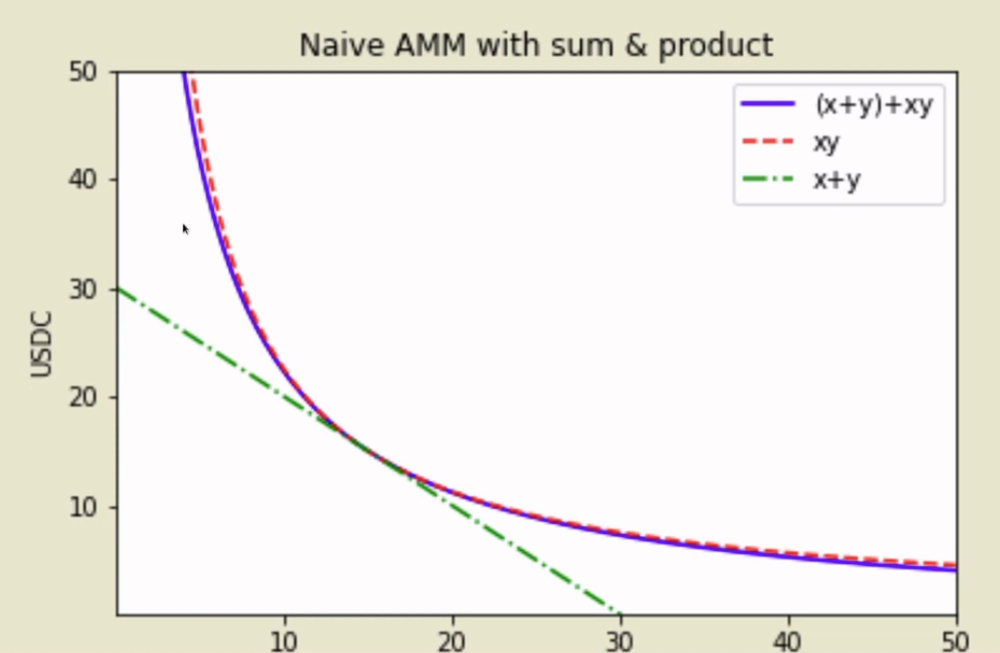
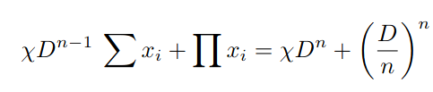
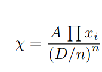
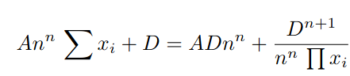

# Curve Finance 

Curve Finance is a decentralized exchange (DEX). Curve Finance focuses on the exchange of stablecoins like USDC or DAI as well as wrapped versions of assets like wBTC or tBTC, despite being similar to other DEXs like Uniswap and Balancer through its low fees and low slippage.

## Why not Uniswap?

The minimum slippage in the curve is 0.03, whereas in Uniswap it's 0.5. So when a trader swaps the stable coin on Uniswap, they get more stable coin in return on Curve. These returns are magnified as the trade gets larger. Users of the Curve who purchase stablecoins can be pretty confident that there won't be any price slippage and that their orders will be filled at the prices they desire. This is due to the fact that stablecoin prices are often dependable and are fixed at a 1:1 ratio to fiat currencies like the dollar.

In contrast, slippage can occur in uniswap trades. You might be shocked by the final purchase price if you utilize Uniswap to trade one cryptocurrency with low price volatility for another with high price volatility. On the Uniswap platform, discrepancies in liquidity among cryptocurrencies can also exacerbate issues with price volatility and slippage.

## How does curve finance work?

Here's the graph of Uniswap and StableSwap (the curve). If I trade a large amount on Uniswap, the token I want to buy will become increasingly expensive. As a result, the more tokens I try to sell, the fewer tokens I receive for the token I desire.

The graph of the curve in the middle is kind of flat, which means if I were to trade in this flat region, I would get a token swap of almost one to one.

So if I swap my ETH for USDC, the pool will get more ETH and less USDC. The point about this curve is that if I have to go from:

It gets very steep. It's a really large jump, meaning the amount of ETH that I get is a lot given that I only have to give a few USDC (see the below figure).

You could say at that point that ETH is really cheap.

The whole point of x * y = k is that we always guarantee liquidity. So the ability to buy or sell inflates the price to a ridiculously high level. You can't ever buy all the USDC because it can't ever reach 0. It becomes inexorably more expensive.

The whole idea of curve finance is that it facilitates swaps between different stablecoins. So if you have USDC, USDT, and DAI, these are all theoretically meant to equal $1 at redemption. However, their prices can fluctuate between $0.95 and $1.05. This is significant because, if USDC is only worth $0.96 and USDT is worth $1.01, there is a $5 difference for every dollar transferred. That is, if I had $100,000 in USDT and wanted to convert it to USDC, I would receive less than $10,000 in USDC. You'll probably get 9600 USDC, which is a net loss of $400. This is ridiculous because both of these coins are equal to exactly $1.

The curve finance uses special curve looks like:

For certain regions, it keeps flat, meaning that when you move between two quantities, the price doesn't really fluctuate that much, whereas on Uniswap, it fluctuates a lot more. The benefit of the flat region is that you have a pretty stable price. However, if you go outside the range, you get a very lopsided range. The reason that this is okay is because the range of stable coins can only be between $0.95 and $1.05. If it varies greater than that, then something else is clearly wrong, and it's actually not a curve problem to keep it within this kind of range that we've defined.

The amazing thing about this particular formula is that the curve can get the slippage (amount of loss between stablecoins) to be literally less than 1%. So in our previous example, rather than losing $400, the most they would lose is maybe $10, which is a massive improvement.

## Math behind Curve Finance

Here we'll derive the equation of the curve, and you'll have a better understanding of how the pricing on the curve is determined. For the trade of stablecoin, we can express it with the equation:

>x + y = C

Let's say we start with 50 DAI (x) and 50 USDC (y). So c equals 100. If I were to sell 20 DAI for USDC, I would get 20 DAI, so the remaining USDC is 30 and DAI is 70. If I sell 30 of my USDC, then the amount of DAI that needs to be inside the pool is 20. In all cases, the total number of tokens remains the same.

However, in the real world, the price of DAI is not exactly equal to the price of USDC. So we also want to use the equation that says, "The price of DAI is not exactly equal to the price of USDC." We can do that with the constant product formula.

> x * y = K

This graph basically says, "The fewer tokens there are, the more expensive it gets."

Curve finance combines these two graphs, and you'll get the curve below.

Let's try creating the curve. We'll start with the condition that says:

> x + y = D

And we'll also use the constant product formula.

> $${ x * y = ( D/2 )^2 }$$

Combining the two equations above, we get,

> $${ x * y + xy = D + ( D/2 )^2 }$$

However, when this equation is plotted on a graph, it looks like this:

not something that's flat in the middle.

We can accomplish it by amplifying the `x + y = D` part of the equation. So we multiply the equation with variable `chi ( χ )`.

> $${ χ (x + y) + xy = χD + ( D/2 )^2 }$$

When the variable `χ = 0` , we're left with 

> $${ x * y = ( D/2 )^2 }$$

So the equation becomes the constant product curve.

On the other hand, when `χ = ∞`, we're left with an equation that looks like a constant sum.

> χ (x + y) = χD

Increasing χ  makes the curve more and more flat.This is also true when x + y is big. So we want to express that when χ  is big, the curve is flat, and when χ is small, the curve acts like a constant product formula regardless of how big or small x + y is. We can do this by taking this equation:

> χ (x + y) = χD

We normalize it by dividing both sides by D. We get:

> Dχ (x + y) = χD^2

Now our equation looks like this:

> $${ Dχ (x + y) + xy = χD^2 + ( D/2 )^2 }$$

This is exactly the same equation that is mentioned in the curve whitepaper.

Furthermore, in the whitepaper, set χ equals to:

In order to do so, we make χ dynamic. When the portfolio is in perfect balance, it’s equal to a constant A, but it falls off to 0 when it's out of balance.

Then we can put the value of chi in the above equation.

"When a portfolio of coins {xi} is loaded up, we need to calculate D, and we
need to hold this equation true when we perform trades (e.g. swap xi into xj ).
That is done by finding an iterative, converging solution either for D, or for xj
when all other variables are known."
