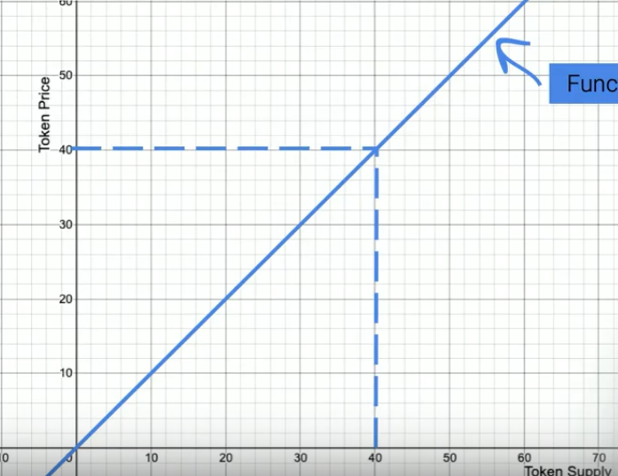
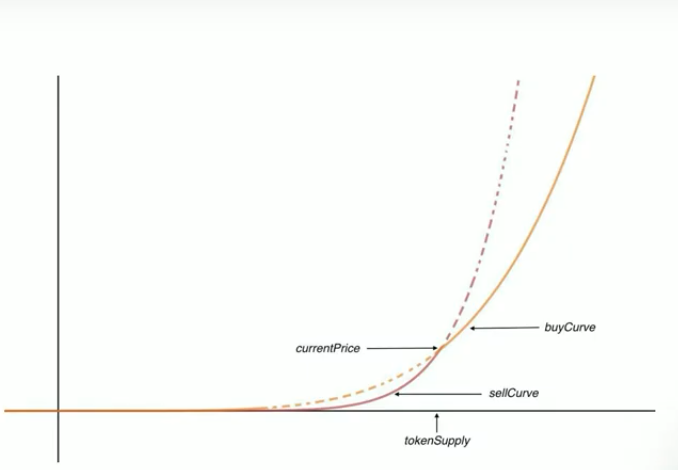
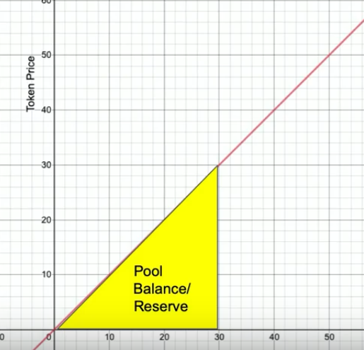

## Token Bonding Curves

Token Bonding Curves are a concept that introduces a dynamic pricing mechanism for tokens based on their changing supply. Unlike traditional fixed-price tokens, the price of tokens following a bonding curve model is determined by the available supply in the market. This pricing model offers flexibility and can be embedded with various incentives, governance rules, and financial mechanisms.

Token bonding curves fall under the token policy and financial incentives aspects of a project. Within the token policy, one can incorporate different incentives, governance rules, and policies into the curve. Financial incentives can also be integrated into the token bonding curve by embedding various incentive mechanisms.

If tokens are considered as non-fungible tokens (NFTs), additional aspects of property rights can be incorporated into the token bonding curve.

**What are token bonding curves?**

The concept of token bonding curves can be visualized as a mathematical curve or function on a graph. In a two-dimensional graph, the X-axis represents the total supply of tokens, while the Y-axis represents the corresponding price. The token bonding curve demonstrates how changes in supply affect the price. The curve represents the relationship between supply and price.

The pricing mechanism based on token bonding curves relies on a direct relationship between the token supply and its price. This approach disregards the influence of the broader market's supply and demand dynamics, focusing instead on the internal ecosystem of the token. By simplifying the pricing model to the number of tokens available in the system, speculation is reduced to some extent.

`Automated Market Making (AMM)` is one of the prominent use cases for token bonding curves. Instead of relying on takers and makers to provide liquidity, the liquidity provision is automated in the code based on the relationship between supply and price.

Alternatively, a different secondary market can be created using two types of curves: a buy curve and a sell curve.

This approach adds complexity and depends on the desired incentives. The design of the curves can be structured to discourage people from selling tokens until a specific point in time to prevent them from incurring losses, thus influencing behavior and incentivizing desired actions.

The versatility of token bonding curves allows them to be applied to various systems and designs. They can be utilized in different forms and can incorporate a wide range of governance and mechanism designs into the curve. This flexibility makes token bonding curves an interesting and exciting concept for token economics and ecosystem development.

## Properties of Bonding Curve

It operates based on following properties:

- Minting:

  Tokens can be minted at any time according to the price set by the smart contract. The minting process is automated and determined by the demand and liquidity added to the ecosystem. This means that no individual or entity has control over the minting process. The smart contract ensures that tokens are issued automatically based on predefined rules.

- Price increase:

  The price of the token increases as the token supply grows. This relationship reflects the economic value and network effects of the ecosystem. As more tokens are available in the market, it indicates a stronger network effect and increased economic value. This, in turn, leads to a higher monetary value for the ecosystem. The increase in token prices signifies growing confidence in the project, as more people buy and utilize the tokens.

- Reserve pool:

  The money collected from the purchase of tokens is stored in a smart contract as a reserve pool or pool balance. This reserve pool acts as collateral to support the value and liquidity of the tokens. Various projects use different mechanisms to determine where these collaterals are kept. The transparency of the smart contract ensures that the collateral is accounted for and provides value to the token pricing.

- Burning:

  Tokens can be burned or destroyed at any time. When tokens are burned, the person who initiated the burning process receives back a proportionate amount of the collateral from the reserve pool. The collateral received is determined by the underlying bonding curve mechanism, not by the initial amount of collateral invested. The bonding curve algorithm tracks and calculates the appropriate amount of collateral to be returned when tokens are burned. This approach reduces the potential for bribery, increases transparency, and maintains accountability for the token supply, pricing, and minting/burning schedule.

Overall, the token bonding curve provides a decentralized and automated mechanism for determining the supply, price, and liquidity of tokens within an ecosystem. It ensures that these factors are determined by the market demand and the actions of participants, rather than by centralized decision-making.

## Use Cases

The token bonding curve can be utilized in various ways, incorporating different incentive mechanisms into its mathematical function. These mechanisms can be customized based on specific use cases. Here are some simplified explanations of the possible applications:

- Instant liquidity:

  Instead of relying on a market maker or taker to fill up the order books, the bonding curve automatically provides liquidity through its mathematical function. This means that buyers and sellers can instantly trade tokens without waiting for external parties to facilitate transactions.

- Continuous minting and burning:

  Unlike traditional systems that rely on governance decisions or profits to determine token minting and burning, the bonding curve handles these processes automatically. The code of the smart contract determines when and how many tokens are minted or burned, based on the predefined rules of the bonding curve.

- Income generation from bid-ask spreads:

  The bonding curve incorporates bid-ask spreads, which are the differences between buying and selling prices. This generates income for the ecosystem, and those who hold the tokens can be rewarded with a portion of these profits. It provides a unique way of incentivizing token holders, similar to staking.

- Embedding incentive mechanisms to reduce pump and dump:

  By adjusting the gradients of the curve functions, the bonding curve can discourage sudden price surges (pumps) or dumps. This helps to stabilize the token price and discourage manipulative trading practices, ensuring a more sustainable market.

- Embedding economic rules:

  The bonding curve can reflect various economic rules within its mathematical function. For example, it can enforce a fixed token supply or incorporate governance rules that translate into specific mathematical formulas. These rules govern the behavior of the token and its ecosystem, providing a transparent and predictable framework.

## Value of Bonding Curve

The value of a bonding curve can be understood in two main ways: through the entitlement to future cash flows and through assigning tangible value, such as in the case of art.

In the first scenario, token holders are entitled to a portion of the future cash flows generated by the ecosystem. This is similar to how tokens like Compound, dYdX, and Balancer operate, where token holders receive a share of the earnings generated by the ecosystem. By holding tokens, their value increases as more cash flows accumulate in the pool balance. When a token holder decides to withdraw their tokens, they can cash in on the increased monetary value based on the current or future cash flows. This is one way of creating intrinsic value in the bonding curve.

The second scenario involves assigning value to art using bonding curves. In this case, the bonding curve assigns a tangible value to the art based on factors like the artist's reputation and the demand for their work. The value of the art increases as more pieces are produced based on the demand, which in turn raises the value associated with the artist's name. This demonstrates how bonding curves can be used to attribute value to different types of tokens.

However, there are potential downsides and risks associated with bonding curves. One possible manipulation is when people artificially pump up the token prices without generating actual economic value in the ecosystem. This can lead to a fraudulent situation where the value is falsely inflated by pumping up the collateral pool size. It is important to carefully evaluate the economic value being generated within the ecosystem to distinguish legitimate value from potential scams.

Another potential manipulation arises from the nature of automated market making (AMM) systems, which bonding curves often rely on. These systems can be vulnerable to manipulation, especially during high-volume transfers. Examples of hacks in systems like BZX and Compound have occurred due to attempts to manipulate prices and drain liquidity pools. However, there are ways to implement restrictions and governance mechanisms to prevent or mitigate such manipulations.

In summary, the value of a bonding curve lies in the entitlement to future cash flows and assigning tangible value to various tokens. However, caution is necessary to distinguish legitimate value creation from potential scams, and measures can be implemented to prevent manipulation within the system.

## Mitigating Risks

There are numerous risks to consider when implementing a model or system. It is important to acknowledge that it is not possible to completely eliminate all risks, but they can be reduced to a certain extent. Therefore, it is necessary to explore additional methods to mitigate the risks associated with your tokens. For instance, one approach is to modify the shape of the curve governing the token's behavior, which can discourage early selling. Another strategy involves implementing a timelock mechanism that restricts the ability to sell a certain amount of tokens immediately after staking them. This mirrors the approach taken by many other tokens.

In order to discourage early selling, penalties can be imposed. These penalties can be enforced either upfront, immediately upon selling, or integrated into the curve functions that govern the token's behavior. Alternatively, a premium can be introduced for selling tokens, requiring sellers to pay an additional amount of money. The funds collected from these premiums can be redistributed to benefit the users and the community associated with the tokens.

Furthermore, it is possible to prevent the sell function altogether until a specific level of maturity is reached. This ensures that the tokens have a certain degree of stability and value before they can be freely traded. Additionally, the supply of tokens can be limited by incorporating constraints into the function governing their distribution. This measure can help maintain scarcity and potentially increase the value of the tokens.

It is important to note that these examples serve as quick illustrations of potential risk mitigation strategies and do not encompass all possible approaches. The main objective is to implement measures that discourage undesirable behaviors, encourage long-term commitment, and cultivate a stable and mutually beneficial ecosystem surrounding the tokens or model at hand.

## Bonding Curve Functions

In the field of mathematics, there are four main types of functions called bonding curve functions. These functions analyze the relationship between two variables, represented as X and Y on a 2D graph. In this case, the variables are tokens and supply. While more complex structures can be built based on additional variables, let's focus on the fundamental relationship between supply and pricing.

Before diving into the functions, it's important to note that some incentive mechanisms are incorporated into the graphs, but they are not the output functions themselves. These mechanisms play a role in the mathematical calculations leading to the final result.

- Linear functions:

  This is a straightforward model where the supply and pricing have a direct correlation. If the supply increases by a certain amount, the pricing also increases by a constant percentage. For example, if the supply goes up by 10%, the pricing will also increase by 10%. This type of function is commonly used in collateral-based applications like USDT, where the minting of tokens is linked to the amount of collateral deposited.

  Linear functions also find application in token pricing for crowdfunding. When more people hold the tokens, their value increases, justified by the economic value generated by the larger community. Linear functions are utilized in the Automated Market Maker (AMM) of Bancor protocol, where they calculate the conversion formula for token pricing based on the token supply.

- Power functions:

  Unlike linear functions, power functions exhibit a less direct relationship between supply and token price. A percentage increase in supply may not result in an equal percentage increase in token price. The magnitude of the price change depends on various factors. Power functions are useful when there are other incentive mechanisms and governance structures in place for the token. They are commonly applied in areas like NFTs and art, where prices can experience exponential growth.

- Logarithmic functions:

  Bancor, for instance, calculates their conversion rate using a logarithmic function. This function ensures a continuous and smooth curve connecting input and output tokens in the liquidity pool. As tokens are bought or sold, the conversion rate gradually adjusts, providing stable and predictable rates for efficient token swaps.

      - Increasing price with token supply: The logarithmic function is chosen because it allows the price of the token to increase gradually as the supply grows. This means that as more tokens are purchased and the supply increases, the price per token rises, albeit at a decreasing rate. This ensures that early adopters can acquire tokens at a lower cost while incentivizing later participants to pay a higher price.

      - Continuous liquidity provision: The token bonding curve provides continuous liquidity to token holders. When someone wants to buy tokens, they can do so directly from the smart contract at the prevailing price determined by the curve. Similarly, when someone wants to sell tokens, they can do it back to the contract and receive the corresponding value according to the current price. This allows for seamless buying and selling without relying on external markets or order books.

      - Price discovery and stability: The logarithmic function helps establish price stability in the bonding curve. By making the price increase at a decreasing rate, it discourages large price fluctuations and speculative behavior. This stability can be beneficial in applications that require a predictable and manageable price environment.

      - Economically sustainable: The logarithmic function helps ensure that the token bonding curve is economically sustainable. As the price increases gradually, it encourages a steady inflow of funds into the ecosystem. This capital influx can be used to fund development, incentivize participants, or back the token with some underlying asset.

- Sigmoid functions:

  Sigmoid functions have a fixed upper limit, allowing for a fixed supply to be embedded into the function as part of the token's monetary policy. The derivation of a sigmoid function follows a normal curve statistically. This curve allows the community to reach a threshold where they can accumulate more rewards. It also includes a programmable upper limit, which represents the token supply. By calculating the critical mass required for the ecosystem to reach the mean of the normal probability function, this information can be embedded into the sigmoid curve. Consequently, the incentive function, and specifically the gradient of rewards, can be adjusted as the number of participants in the ecosystem increases.

## How do you calculate the price?

To determine the price of tokens in the bonding curve, we can use a simple calculation. The price is essentially the area under the curve on the graph.

This involves integrating the curve function and examining the change in token supply. By doing this, we can determine the amount of collateral you will receive when putting in collateral or the number of tokens that will be minted and given to you when providing collateral.

Smart contracts handle these calculations automatically, but it's important to keep them efficient. Complex calculations can slow down the processing time and lead to undesirable "beta slippage." Integration is a straightforward method for calculating the collateral received or the number of tokens minted based on the provided collateral.

These various token functions serve as essential building blocks within the overall design of an economic system. The key is to carefully select and implement the functions that align with the objectives of your ecosystem, incorporating different elements and incentives as needed.

**Token Functions**

Let's explore the different types of applications of token bonding curves based on their functions, with a focus on four main categories:

- Security Tokens:
  Security tokens represent underlying financial assets, similar to traditional securities. However, in this context, "security" refers to the financial aspect rather than cybersecurity. Token bonding curves can be employed as a mechanism for continuous funding. When companies require additional funds, they can utilize a token bonding curve rather than approaching investors directly. This allows for a streamlined process of fundraising within the ecosystem.

- Utility Tokens:
  Utility tokens are internal tokens that hold value and are primarily used within the ecosystem itself. By integrating a token bonding curve into a utility token, you can establish an internal price value for the token, which can be utilized for various exchanges and transactions within the ecosystem. This approach facilitates the efficient flow and exchange of value within the system.

- Money Tokens:
  Money tokens are designed to function as currencies within the ecosystem. The implementation of a token bonding curve in this context depends on the specific use case. Notably, a special category within money tokens is pegged tokens. These tokens are pegged to a specific asset or currency, such as BTC and wBTC, ETH and wETH, or USD and USDT. By pegging the token to an external asset, its value remains stable and provides a reliable medium of exchange.

- Stable Tokens (PEG Tokens):
  Stable tokens, often referred to as PEG tokens, are designed to maintain a stable value by pegging them to a specific asset or currency. The relationship between the value of the pegged token and the underlying asset is straightforward. For instance, a simple representation of the relationship can be expressed as y = x, indicating a one-to-one peg. When a specific amount of the underlying asset (e.g., BTC) is added to the token bonding curve, the curve automatically mints the corresponding amount of the pegged token (e.g., wBTC). The underlying asset is held as collateral within the area under the curve. While the addition of value is not significant in this case, it improves operational efficiency by removing the need for human intervention.
